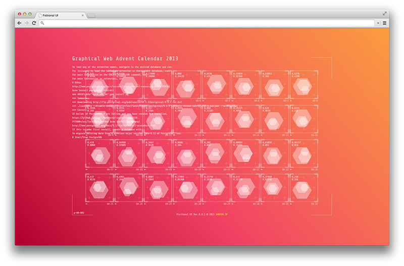

# Graphical Web Advent Calendar 2013, Day 23

このリポジトリは[Graphical Web Advent Calendar 2013](http://www.adventar.org/calendars/68)の23日目のエントリーです。

## Fictional UI with Inline SVG

ヱヴァンゲリヲン新劇場版：Q を映画館に観に行ったんです。劇中にでてくる機器のコントローラーやインジケーターが大変カッコ良くて、話の内容とか全く覚えてないくらいにUIばっかりを凝視していて、僕も「何に使うかは全くわからないけれども、なんとなく動いていて、なんとなく未来感があって、なんとなくかっこよさげなもの」を作りたくなったのが約一年前……。当時、数日作ってプロトタイプ作ったところで放置していたので、こんな良い機会があるんだから完成させなければ！と、なんとか公開できる状態にしました。

このAdvent CalendarがGraphical Webというシリーズということなので、折角なら画像は一切使わずに作ってみよう！ってことでビットマップ画像は一切使用していません。図形の類はInline SVGを使っています。Inline SVGは手書きしたんですが、SVGは手で書くもんじゃないってことがよくわかったのが一番の収穫でしょうか。動くものを作るって楽しいですね。

## Preview

以下から実際に動いているものを見られます。が、**Google Chrome**でしか見てないのでその他のブラウザで動くかは不明です。

* [Fictional UI](http://saucer-jp.github.io/fictional-UI)